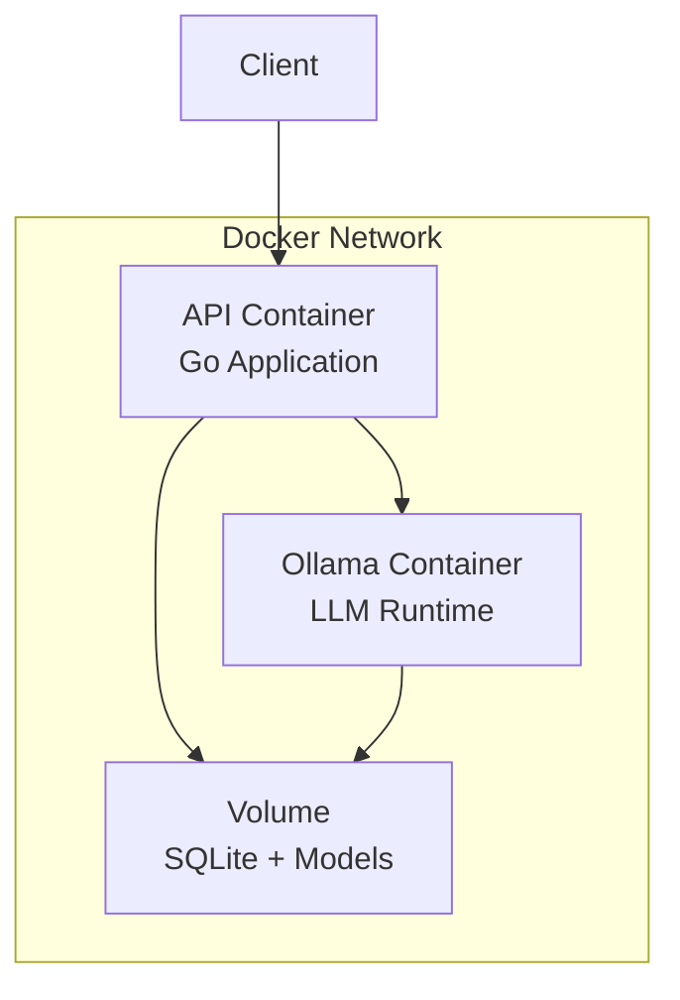

# Chat Ollama MVP Architecture Specification

## 1. Executive Summary

This document outlines the architectural design for the MVP of the modular Dockerized Ollama frontend. The MVP focuses on core chat functionality with real-time streaming, basic memory persistence, and Ollama integration while maintaining simplicity and extensibility.

### Key Design Decisions
- **Simple First**: SQLite for persistence, chi router for HTTP handling
- **Streaming Focus**: Server-Sent Events (SSE) for real-time token delivery
- **Container-Ready**: Docker-first deployment with minimal dependencies
- **Extensible Foundation**: Clean architecture patterns for future feature additions

## 2. Project Structure

```
chat_ollama/
├── cmd/
│   └── api/
│       └── main.go                 # Application entry point
├── internal/
│   ├── api/
│   │   ├── handlers/
│   │   │   ├── chat.go            # Chat endpoint handlers
│   │   │   ├── health.go          # Health check handlers
│   │   │   └── memory.go          # Memory CRUD handlers
│   │   ├── middleware/
│   │   │   ├── cors.go            # CORS middleware
│   │   │   ├── logging.go         # Request logging
│   │   │   └── recovery.go        # Panic recovery
│   │   └── router.go              # Chi router setup
│   ├── config/
│   │   └── config.go              # Configuration management
│   ├── database/
│   │   ├── sqlite.go              # SQLite connection & setup
│   │   └── migrations.go          # Migration runner
│   ├── models/
│   │   ├── chat.go                # Chat-related models
│   │   ├── memory.go              # Memory models
│   │   └── session.go             # Session models
│   ├── services/
│   │   ├── chat.go                # Chat orchestration service
│   │   ├── memory.go              # Memory management service
│   │   └── ollama.go              # Ollama client service
│   └── utils/
│       ├── errors.go              # Error handling utilities
│       ├── logger.go              # Structured logging
│       └── response.go            # HTTP response helpers
├── migrations/
│   ├── 001_initial_schema.sql     # Initial database schema
│   └── 002_add_indexes.sql        # Performance indexes
├── docker/
│   ├── api.Dockerfile             # API service Dockerfile
│   └── docker-compose.yml         # Multi-container setup
├── scripts/
│   ├── build.sh                   # Build script
│   └── dev.sh                     # Development setup
├── docs/
│   ├── api.md                     # API documentation
│   └── deployment.md              # Deployment guide
├── .env.example                   # Environment variables template
├── go.mod
├── go.sum
├── Makefile                       # Build automation
└── README.md
```

## 3. API Design

### 3.1 Core Endpoints

#### POST /v1/chat
**Purpose**: Initiate chat conversation with streaming response

**Request**:
```json
{
  "message": "Hello, how are you?",
  "session_id": "uuid-v4-string",
  "model": "llama2:7b",
  "stream": true,
  "options": {
    "temperature": 0.7,
    "max_tokens": 2048
  }
}
```

**Response** (SSE Stream):
```
data: {"type":"token","content":"Hello","session_id":"uuid"}
data: {"type":"token","content":" there","session_id":"uuid"}
data: {"type":"done","session_id":"uuid","total_tokens":150}
```

**Response** (Non-streaming):
```json
{
  "id": "msg-uuid",
  "session_id": "session-uuid",
  "content": "Hello there! I'm doing well, thank you for asking.",
  "model": "llama2:7b",
  "created_at": "2024-01-15T10:30:00Z",
  "tokens_used": 150
}
```

#### GET /v1/sessions
**Purpose**: List user sessions

**Response**:
```json
{
  "sessions": [
    {
      "id": "session-uuid",
      "title": "Chat about AI",
      "created_at": "2024-01-15T10:00:00Z",
      "updated_at": "2024-01-15T10:30:00Z",
      "message_count": 5
    }
  ]
}
```

#### GET /v1/sessions/{id}/messages
**Purpose**: Get conversation history

**Response**:
```json
{
  "session_id": "session-uuid",
  "messages": [
    {
      "id": "msg-uuid-1",
      "role": "user",
      "content": "Hello",
      "created_at": "2024-01-15T10:00:00Z"
    },
    {
      "id": "msg-uuid-2",
      "role": "assistant",
      "content": "Hello there!",
      "created_at": "2024-01-15T10:00:05Z",
      "tokens_used": 25
    }
  ]
}
```

#### GET /health
**Purpose**: Health check endpoint

**Response**:
```json
{
  "status": "healthy",
  "timestamp": "2024-01-15T10:30:00Z",
  "services": {
    "database": "healthy",
    "ollama": "healthy"
  }
}
```

### 3.2 Error Responses

All errors follow RFC 7807 Problem Details format:

```json
{
  "type": "https://api.chat-ollama.com/errors/validation",
  "title": "Validation Error",
  "status": 400,
  "detail": "The message field is required",
  "instance": "/v1/chat",
  "timestamp": "2024-01-15T10:30:00Z"
}
```

## 4. Database Schema

### 4.1 SQLite Schema

```sql
-- Sessions table
CREATE TABLE sessions (
    id TEXT PRIMARY KEY,
    title TEXT NOT NULL DEFAULT 'New Chat',
    created_at DATETIME DEFAULT CURRENT_TIMESTAMP,
    updated_at DATETIME DEFAULT CURRENT_TIMESTAMP
);

-- Messages table
CREATE TABLE messages (
    id TEXT PRIMARY KEY,
    session_id TEXT NOT NULL,
    role TEXT NOT NULL CHECK (role IN ('user', 'assistant', 'system')),
    content TEXT NOT NULL,
    model TEXT,
    tokens_used INTEGER DEFAULT 0,
    created_at DATETIME DEFAULT CURRENT_TIMESTAMP,
    FOREIGN KEY (session_id) REFERENCES sessions(id) ON DELETE CASCADE
);

-- Indexes for performance
CREATE INDEX idx_messages_session_id ON messages(session_id);
CREATE INDEX idx_messages_created_at ON messages(created_at);
CREATE INDEX idx_sessions_updated_at ON sessions(updated_at);

-- Trigger to update session updated_at
CREATE TRIGGER update_session_timestamp 
    AFTER INSERT ON messages
    BEGIN
        UPDATE sessions 
        SET updated_at = CURRENT_TIMESTAMP 
        WHERE id = NEW.session_id;
    END;
```

### 4.2 Data Models

```go
// Session represents a chat session
type Session struct {
    ID           string    `json:"id" db:"id"`
    Title        string    `json:"title" db:"title"`
    CreatedAt    time.Time `json:"created_at" db:"created_at"`
    UpdatedAt    time.Time `json:"updated_at" db:"updated_at"`
    MessageCount int       `json:"message_count,omitempty"`
}

// Message represents a chat message
type Message struct {
    ID         string    `json:"id" db:"id"`
    SessionID  string    `json:"session_id" db:"session_id"`
    Role       string    `json:"role" db:"role"`
    Content    string    `json:"content" db:"content"`
    Model      string    `json:"model,omitempty" db:"model"`
    TokensUsed int       `json:"tokens_used,omitempty" db:"tokens_used"`
    CreatedAt  time.Time `json:"created_at" db:"created_at"`
}
```

## 5. Docker Architecture

### 5.1 Container Design



### 5.2 Docker Compose Configuration

```yaml
version: '3.8'

services:
  api:
    build:
      context: .
      dockerfile: docker/api.Dockerfile
    ports:
      - "8080:8080"
    environment:
      - ENV=production
      - DB_PATH=/data/chat.db
      - OLLAMA_HOST=ollama:11434
      - LOG_LEVEL=info
    volumes:
      - chat_data:/data
    depends_on:
      - ollama
    restart: unless-stopped
    healthcheck:
      test: ["CMD", "curl", "-f", "http://localhost:8080/health"]
      interval: 30s
      timeout: 10s
      retries: 3

  ollama:
    image: ollama/ollama:latest
    ports:
      - "11434:11434"
    volumes:
      - ollama_models:/root/.ollama
    environment:
      - OLLAMA_ORIGINS=*
      - OLLAMA_HOST=0.0.0.0
    restart: unless-stopped
    healthcheck:
      test: ["CMD", "curl", "-f", "http://localhost:11434/api/tags"]
      interval: 30s
      timeout: 10s
      retries: 3

volumes:
  chat_data:
    driver: local
  ollama_models:
    driver: local

networks:
  default:
    name: chat_ollama_network
```

### 5.3 API Dockerfile

```dockerfile
# Build stage
FROM golang:1.22-alpine AS builder

WORKDIR /app

# Install build dependencies
RUN apk add --no-cache gcc musl-dev sqlite-dev

# Copy go mod files
COPY go.mod go.sum ./
RUN go mod download

# Copy source code
COPY . .

# Build with CGO enabled for SQLite
RUN CGO_ENABLED=1 GOOS=linux go build -a -ldflags '-linkmode external -extldflags "-static"' -o main ./cmd/api

# Final stage
FROM alpine:latest

RUN apk --no-cache add ca-certificates curl
WORKDIR /root/

# Copy binary and migrations
COPY --from=builder /app/main .
COPY --from=builder /app/migrations ./migrations

# Create data directory
RUN mkdir -p /data

EXPOSE 8080

HEALTHCHECK --interval=30s --timeout=10s --start-period=5s --retries=3 \
  CMD curl -f http://localhost:8080/health || exit 1

CMD ["./main"]
```

## 6. Configuration Management

### 6.1 Environment Variables

```go
type Config struct {
    // Server configuration
    Port         string `env:"PORT" envDefault:"8080"`
    Host         string `env:"HOST" envDefault:"0.0.0.0"`
    Environment  string `env:"ENV" envDefault:"development"`
    
    // Database configuration
    DBPath       string `env:"DB_PATH" envDefault:"./data/chat.db"`
    
    // Ollama configuration
    OllamaHost   string `env:"OLLAMA_HOST" envDefault:"localhost:11434"`
    OllamaTimeout time.Duration `env:"OLLAMA_TIMEOUT" envDefault:"30s"`
    
    // Logging configuration
    LogLevel     string `env:"LOG_LEVEL" envDefault:"info"`
    LogFormat    string `env:"LOG_FORMAT" envDefault:"json"`
    
    // Performance configuration
    MaxConcurrentChats int `env:"MAX_CONCURRENT_CHATS" envDefault:"100"`
    ReadTimeout       time.Duration `env:"READ_TIMEOUT" envDefault:"30s"`
    WriteTimeout      time.Duration `env:"WRITE_TIMEOUT" envDefault:"30s"`
}
```

### 6.2 Configuration Loading

```go
func LoadConfig() (*Config, error) {
    cfg := &Config{}
    
    // Load from environment variables
    if err := env.Parse(cfg); err != nil {
        return nil, fmt.Errorf("failed to parse config: %w", err)
    }
    
    // Validate configuration
    if err := cfg.Validate(); err != nil {
        return nil, fmt.Errorf("invalid config: %w", err)
    }
    
    return cfg, nil
}
```

## 7. Streaming Implementation

### 7.1 Server-Sent Events (SSE)

**Choice Rationale**: SSE is simpler than WebSockets for unidirectional streaming and works well with HTTP/2.

```go
type StreamResponse struct {
    Type      string `json:"type"`
    Content   string `json:"content,omitempty"`
    SessionID string `json:"session_id"`
    Error     string `json:"error,omitempty"`
    Metadata  map[string]interface{} `json:"metadata,omitempty"`
}

func (h *ChatHandler) StreamChat(w http.ResponseWriter, r *http.Request) {
    // Set SSE headers
    w.Header().Set("Content-Type", "text/event-stream")
    w.Header().Set("Cache-Control", "no-cache")
    w.Header().Set("Connection", "keep-alive")
    w.Header().Set("Access-Control-Allow-Origin", "*")
    
    flusher, ok := w.(http.Flusher)
    if !ok {
        http.Error(w, "Streaming unsupported", http.StatusInternalServerError)
        return
    }
    
    // Create context with timeout
    ctx, cancel := context.WithTimeout(r.Context(), 5*time.Minute)
    defer cancel()
    
    // Stream tokens from Ollama
    tokenChan := make(chan StreamResponse, 100)
    go h.chatService.StreamResponse(ctx, req, tokenChan)
    
    for {
        select {
        case token := <-tokenChan:
            data, _ := json.Marshal(token)
            fmt.Fprintf(w, "data: %s\n\n", data)
            flusher.Flush()
            
            if token.Type == "done" || token.Type == "error" {
                return
            }
        case <-ctx.Done():
            return
        }
    }
}
```

### 7.2 Connection Management

```go
type ConnectionManager struct {
    connections map[string]*Connection
    mu          sync.RWMutex
    maxConns    int
}

type Connection struct {
    ID        string
    SessionID string
    Writer    http.ResponseWriter
    Flusher   http.Flusher
    Done      chan struct{}
    CreatedAt time.Time
}

func (cm *ConnectionManager) AddConnection(conn *Connection) error {
    cm.mu.Lock()
    defer cm.mu.Unlock()
    
    if len(cm.connections) >= cm.maxConns {
        return errors.New("max connections reached")
    }
    
    cm.connections[conn.ID] = conn
    return nil
}
```

## 8. Ollama Integration

### 8.1 Client Implementation

```go
type OllamaClient struct {
    baseURL    string
    httpClient *http.Client
    timeout    time.Duration
}

type ChatRequest struct {
    Model   string                 `json:"model"`
    Messages []Message             `json:"messages
>>>>>>> REPLACE

```

### 8.2 Health Check Integration

```go
func (c *OllamaClient) HealthCheck(ctx context.Context) error {
    req, err := http.NewRequestWithContext(ctx, "GET", c.baseURL+"/api/tags", nil)
    if err != nil {
        return fmt.Errorf("failed to create health check request: %w", err)
    }
    
    resp, err := c.httpClient.Do(req)
    if err != nil {
        return fmt.Errorf("ollama health check failed: %w", err)
    }
    defer resp.Body.Close()
    
    if resp.StatusCode != http.StatusOK {
        return fmt.Errorf("ollama health check returned status %d", resp.StatusCode)
    }
    
    return nil
}
```

## 9. Error Handling Strategy

### 9.1 Error Types

```go
// Custom error types for different scenarios
type ErrorType string

const (
    ErrorTypeValidation   ErrorType = "validation"
    ErrorTypeNotFound     ErrorType = "not_found"
    ErrorTypeInternal     ErrorType = "internal"
    ErrorTypeOllama       ErrorType = "ollama"
    ErrorTypeDatabase     ErrorType = "database"
    ErrorTypeRateLimit    ErrorType = "rate_limit"
)

type APIError struct {
    Type      ErrorType `json:"type"`
    Title     string    `json:"title"`
    Status    int       `json:"status"`
    Detail    string    `json:"detail"`
    Instance  string    `json:"instance"`
    Timestamp time.Time `json:"timestamp"`
}

func (e APIError) Error() string {
    return fmt.Sprintf("%s: %s", e.Title, e.Detail)
}
```

### 9.2 Error Middleware

```go
func ErrorMiddleware(next http.Handler) http.Handler {
    return http.HandlerFunc(func(w http.ResponseWriter, r *http.Request) {
        defer func() {
            if err := recover(); err != nil {
                logger := log.FromContext(r.Context())
                logger.Error("panic recovered", "error", err, "stack", debug.Stack())
                
                apiErr := APIError{
                    Type:      ErrorTypeInternal,
                    Title:     "Internal Server Error",
                    Status:    http.StatusInternalServerError,
                    Detail:    "An unexpected error occurred",
                    Instance:  r.URL.Path,
                    Timestamp: time.Now(),
                }
                
                writeErrorResponse(w, apiErr)
            }
        }()
        
        next.ServeHTTP(w, r)
    })
}

func writeErrorResponse(w http.ResponseWriter, err APIError) {
    w.Header().Set("Content-Type", "application/json")
    w.WriteHeader(err.Status)
    json.NewEncoder(w).Encode(err)
}
```

## 10. Performance Optimization

### 10.1 Connection Pooling

```go
type ConnectionPool struct {
    db          *sql.DB
    maxOpen     int
    maxIdle     int
    maxLifetime time.Duration
}

func NewConnectionPool(dbPath string) (*ConnectionPool, error) {
    db, err := sql.Open("sqlite3", dbPath+"?_journal_mode=WAL&_synchronous=NORMAL&_cache_size=1000")
    if err != nil {
        return nil, err
    }
    
    // Configure connection pool for SQLite
    db.SetMaxOpenConns(1)  // SQLite works best with single connection
    db.SetMaxIdleConns(1)
    db.SetConnMaxLifetime(0) // No limit for SQLite
    
    return &ConnectionPool{
        db:          db,
        maxOpen:     1,
        maxIdle:     1,
        maxLifetime: 0,
    }, nil
}
```

### 10.2 Caching Strategy

```go
type MemoryCache struct {
    sessions map[string]*Session
    messages map[string][]Message
    mu       sync.RWMutex
    ttl      time.Duration
}

func (c *MemoryCache) GetSession(id string) (*Session, bool) {
    c.mu.RLock()
    defer c.mu.RUnlock()
    
    session, exists := c.sessions[id]
    return session, exists
}
```

## 11. Security Implementation

### 11.1 Input Validation

```go
type Validator struct {
    maxMessageLength int
    allowedModels    []string
}

func (v *Validator) ValidateChatRequest(req *ChatRequest) error {
    if req.Message == "" {
        return errors.New("message cannot be empty")
    }
    
    if len(req.Message) > v.maxMessageLength {
        return fmt.Errorf("message too long (max %d characters)", v.maxMessageLength)
    }
    
    return nil
}
```

## 12. Deployment Configuration

### 12.1 Production Dockerfile

```dockerfile
# Multi-stage build optimized for production
FROM golang:1.22-alpine AS builder

WORKDIR /app
RUN apk add --no-cache gcc musl-dev sqlite-dev

COPY go.mod go.sum ./
RUN go mod download

COPY . .
RUN CGO_ENABLED=1 GOOS=linux go build -a -ldflags '-linkmode external -extldflags "-static"' -o main ./cmd/api

FROM alpine:latest
RUN apk --no-cache add ca-certificates curl
WORKDIR /root/

COPY --from=builder /app/main .
COPY --from=builder /app/migrations ./migrations

RUN mkdir -p /data
EXPOSE 8080

HEALTHCHECK --interval=30s --timeout=10s --start-period=5s --retries=3 \
  CMD curl -f http://localhost:8080/health || exit 1

CMD ["./main"]
```

## 13. Implementation Roadmap

### Phase 1: Core Foundation (Week 1)
- [ ] Set up project structure with Go modules
- [ ] Implement basic HTTP server with chi router
- [ ] Create SQLite database connection and migrations
- [ ] Implement basic health check endpoint

### Phase 2: Chat Functionality (Week 2)
- [ ] Implement Ollama client integration
- [ ] Create chat endpoint with basic request/response
- [ ] Add message persistence to SQLite
- [ ] Implement session management

### Phase 3: Streaming Implementation (Week 3)
- [ ] Add Server-Sent Events support
- [ ] Implement real-time token streaming
- [ ] Add connection management
- [ ] Performance testing and optimization

### Phase 4: Production Readiness (Week 4)
- [ ] Add comprehensive error handling
- [ ] Implement structured logging
- [ ] Add Docker containerization
- [ ] Performance benchmarking and tuning

## 14. Success Metrics

### Performance Targets
- **Latency**: <100ms overhead beyond Ollama response time
- **Throughput**: Support 100 concurrent streaming connections
- **Memory**: <512MB RAM usage under normal load
- **Storage**: Efficient SQLite operations with <10ms query time

### Quality Metrics
- **Uptime**: 99.9% availability
- **Error Rate**: <0.1% of requests result in 5xx errors
- **Response Time**: 95th percentile <500ms for non-streaming endpoints
- **Resource Usage**: CPU usage <70% under peak load

## 15. Future Extensibility

### Planned Extensions
1. **RAG Integration**: Vector database support for document retrieval
2. **Web Search**: Pluggable search provider interface
3. **Code Execution**: Sandboxed code execution environment
4. **MCP Integration**: Model Context Protocol server support
5. **Multi-tenancy**: User authentication and isolation

### Architecture Patterns
- **Plugin System**: Interface-based tool registration
- **Event-Driven**: Async processing for heavy operations
- **Microservices**: Service decomposition for scaling
- **Observability**: Comprehensive monitoring and tracing

---

## Conclusion

This architecture provides a solid foundation for the Chat Ollama MVP while maintaining simplicity and extensibility. The design prioritizes:

1. **Simplicity**: SQLite for storage, chi for routing, minimal dependencies
2. **Performance**: Optimized for <100ms latency and 100 concurrent users
3. **Reliability**: Comprehensive error handling and health monitoring
4. **Extensibility**: Clean interfaces for future feature additions
5. **Operability**: Docker-first deployment with proper logging and metrics

The implementation should follow this specification closely while allowing for tactical adjustments based on real-world testing and feedback.